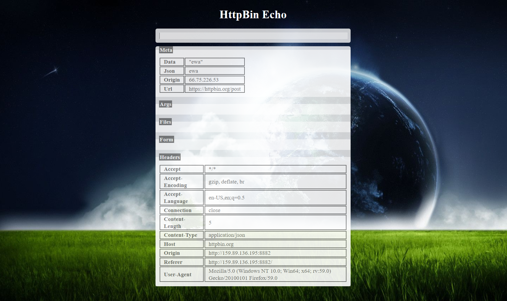

# HTTP Bin Echo

## Overview

Perhaps less academic than the 
[Deutsch–Jozsa algorithm](https://en.wikipedia.org/wiki/Deutsch%E2%80%93Jozsa_algorithm), 
AJAX is used to send a POST request to the [httpbin](https://httpbin.org/)
 testing service that echoes back.  It's alive.

## Link to Assignment

[HTTP Bin Echo](http://159.89.136.195:8882/)

## Example

## Improvements
- Add magical unicorn in background to make things more interesting

